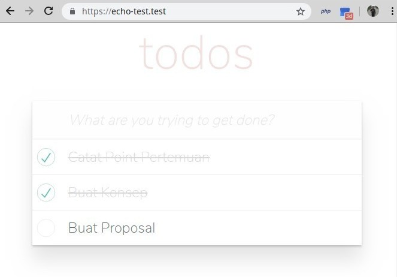

# Laravel Echo Server - Example

This is a laravel-echo-server usage example on Laravel Todo List project. Implementing [Todolist-Vue-Laravel-Pusher](https://pusher.com/tutorials/todo-vue-laravel) tutorial with [Laravel Echo Server](https://github.com/tlaverdure/laravel-echo-server) package.

## How to use

### Preparations

[todo]

### Installation Steps

[todo]

## License

Please use and re-use however you want.
